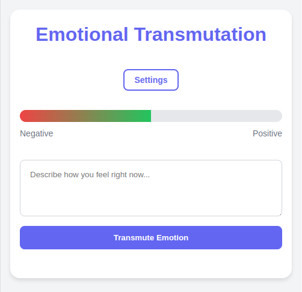

# Emotional Transmutation

<div align="center">
  
</div>

A web application that helps users transform their emotional states using the Hermetic Laws of Rhythm and Polarity. This tool provides suggestions and insights to transmute negative emotions into positive ones, based on the principle that everything flows between poles and follows a rhythmic motion.

## Demo
🌐 [Live Demo](https://luisreinoso.dev/emotional-transmutation)

## Hermetic Principles Applied

### Law of Polarity
Everything has two poles and can be transmuted from one pole to another. In emotions, this means that every negative state has its positive counterpart, and we can consciously move from one to the other.

### Law of Rhythm
All energy has a natural rhythm of ebb and flow. Understanding this principle allows us to consciously work with our emotional rhythms instead of being unconsciously controlled by them.

## Features

- 🔄 Emotional state transmutation based on user descriptions
- 📊 Visual mood intensity bar showing the polarity spectrum
- 🌍 Multilingual support (English and Spanish)
- 🔐 Access key protection
- 📱 Responsive design
- 📝 Local history tracking for emotional rhythm awareness
- 🎨 Modern and intuitive interface

## How It Works

1. Enter your emotional state description
2. The application analyzes your emotion and identifies its position in the polarity spectrum
3. Using the Laws of Rhythm and Polarity, it generates the transmuted emotional state
4. Receive personalized suggestions for emotional transmutation
5. Track your emotional journey through the history feature to understand your personal rhythms

## Technologies Used

- HTML5
- CSS3
- JavaScript (Vanilla)
- Local Storage for data persistence

## Getting Started

1. Clone the repository:
```bash
git clone https://github.com/yourusername/emotional-transmutation.git
```

2. Open `index.html` in your web browser

3. Use the default access key: `1234567890` or configure your own

## Configuration

### Access Key
- Click on the "Settings" button
- Select "Access Key"
- Enter your preferred access key

### Language
- Click on the "Settings" button
- Select "Language"
- Choose between English and Spanish

## API Integration

The application connects to an emotional transmutation API endpoint that processes the emotional descriptions and applies the Hermetic Laws to return:

- Identified emotion and its polarity
- Transmuted emotion (opposite pole)
- Emotional intensity (1-10) on the polarity spectrum
- Transmutation suggestions based on rhythmic progression

## Contributing

Contributions are welcome! Please feel free to submit a Pull Request.

## License

This project is licensed under the MIT License - see the [LICENSE](LICENSE) file for details. 